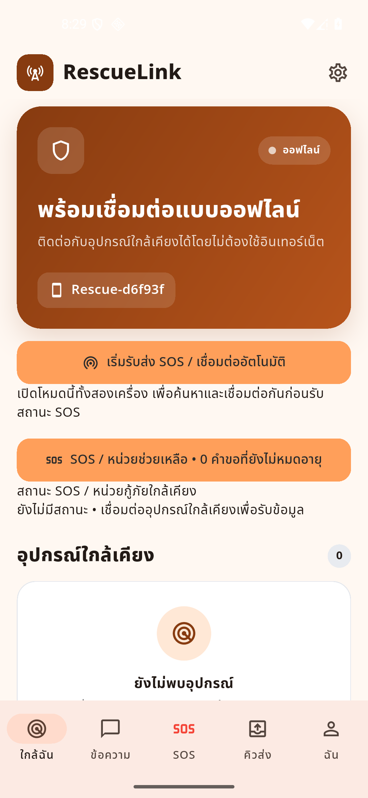
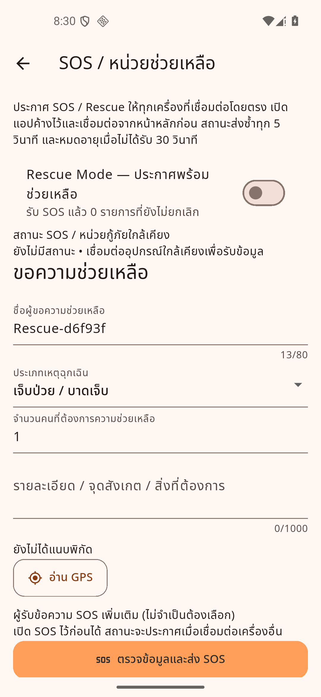
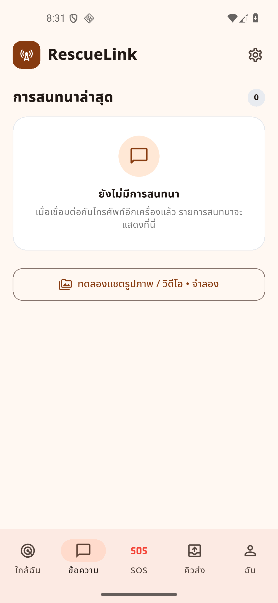
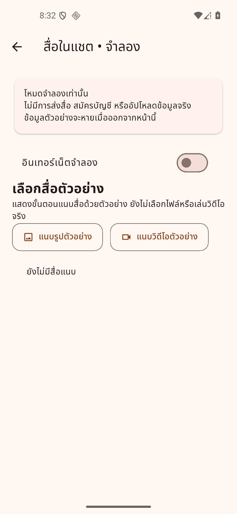

# ผลทดสอบ UX/UI เบื้องต้น — RescueLink

สรุปวันที่ 2026-09-27 จากภาพ Android emulator ที่เก็บไว้ในรอบก่อน และการรัน widget tests ซ้ำในรอบนี้

**ผลรวม: โฟลว์ที่มี tests ยังทำงาน แต่ UI ยังไม่พร้อมปิด Phase 1 ต้องปรับลำดับข้อมูลและประสบการณ์ใช้งานก่อนเก็บชุดส่ง**

รอบนี้ตรวจและเก็บหลักฐานเท่านั้น ไม่แก้โค้ดแอป ไม่เผยแพร่ SOS หรือส่งข้อมูลให้บุคคลอื่น

## หลักฐานและขอบเขต

- APK จาก checkpoint `a4d9a04` / implementation `f94ee34`
- ภาพ Android Pixel 5 emulator ขนาด 1080 × 2340: Home, SOS, ข้อความว่าง, สื่อจำลอง
- ภาพมาจากแอป Flutter จริง ไม่ใช่ ui-preview; ยังไม่ใช่การทดสอบบนโทรศัพท์จริง
- รอบแรก emulator มี System UI ไม่ตอบสนองก่อนเปิดแอป ต้อง cold boot; ไม่จัดปัญหานี้เป็นข้อผิดพลาดของ RescueLink
- รอบต่อ emulator ยังแสดง offline จึงไม่อ้างว่ากดทดสอบทุกหน้าบน Android ครบ
- ไม่ทดสอบการรับส่งสองเครื่อง, สัญญาณจริง, GPS จริง, cloud จริง หรือการส่งสื่อจริง

## สิ่งที่ผ่าน

รัน `flutter test test/demo_features_screen_test.dart test/sos_screen_test.dart test/phase_4_widgets_test.dart` ผ่านทั้ง 6 tests:

1. บัญชี/ซิงก์จำลองต้องออนไลน์และเข้าบัญชีก่อน; จำลองข้อผิดพลาดและลองใหม่สำเร็จ
2. สื่อตัวอย่างแสดงค้างส่งและเปลี่ยนสถานะตามโหมดจำลอง; ออกจากหน้าแล้วข้อมูลตัวอย่างหาย
3. SOS ต้องยืนยันก่อนเผยแพร่ และไม่บังคับเลือกผู้รับรายคน
4. การ์ด Rescue แสดงข้อมูล SOS และเปิดแชตของผู้ส่ง
5. สถานะ SOS แดง, Rescue น้ำเงิน, หมดอายุเทา และเปิดแชตได้
6. ปุ่มแผนที่ส่งพิกัดถูกต้องและรองรับกรณีไม่มีแอปแผนที่

Tests เหล่านี้ใช้ข้อมูล/บริการทดสอบ ไม่ยืนยันการเชื่อมต่อหรือผลบนอุปกรณ์จริง

จากภาพ: ฟอนต์ไทยแสดงได้, เมนูหลักอยู่ด้านล่าง, หน้าว่างข้อความอธิบายได้ และหน้าสื่อมีป้ายจำลองชัดเจน

## จุดที่ควรแก้ตามลำดับ

| ลำดับ | ปัญหาและหลักฐาน | ผลต่อผู้ใช้ | แนวทางแก้ |
|---|---|---|---|
| 1 สูง | หน้า SOS เริ่มด้วยข้อความส่งซ้ำ 5 วินาที/หมดอายุ 30 วินาที, Rescue switch และสถานะใกล้เคียง ก่อนแบบฟอร์ม (`sos.png`) | ผู้ประสบภัยต้องอ่านข้อมูลของหลายบทบาทก่อนพบงานหลัก | แยก “ขอความช่วยเหลือ” กับ “พร้อมช่วยเหลือ”; ย้ายรายละเอียดระบบไปส่วนอ่านเพิ่มเติม; ให้ชื่อเหตุ/พิกัด/ปุ่มดำเนินการเด่น |
| 2 สูง | สื่อจำลองใช้สวิตช์อินเทอร์เน็ตเปลี่ยนจากค้างส่งเป็นส่งแล้ว (`demo_features_screen.dart`) | สื่อสารผิดว่าการส่งสื่อต้องใช้อินเทอร์เน็ต ทั้งที่โปรเจ็กต์เน้น Nearby offline | แยกสถานะ “เชื่อมต่ออุปกรณ์” สำหรับส่ง กับ “มีอินเทอร์เน็ต” สำหรับซิงก์; คงป้ายจำลอง |
| 3 กลาง | Hero หน้าแรกใหญ่ สีน้ำตาลเข้ม และมีปุ่มยาวสองแถวพร้อมคำอธิบายก่อนรายการคน (`home.png`) | สแกนรายชื่อ/สถานะผู้ต้องการความช่วยเหลือช้า; หน้าตายังห่างจากต้นแบบสีส้มอ่อน | ลด Hero เป็นแถบสถานะ; แยกปุ่มเชื่อมต่อออกจาก SOS; ดันรายการคนขึ้น |
| 4 กลาง | ไม่มีคนเชื่อมต่อแล้วหน้าแชตมีเพียงการ์ดว่างกับปุ่มสื่อจำลอง (`messages.png`) | ไม่มีทางลัดไปเริ่มสนทนาจริงในบริบทนั้น | เพิ่มปุ่ม “ค้นหาอุปกรณ์ใกล้เคียง”; ลดความเด่นของทางเข้าสาธิต |
| 5 กลาง | กดแนบสื่อเปิดหน้าสาธิตแยก มีเพียงแถวชื่อรูป/วิดีโอ ไม่ใช่ตัวอย่างในห้องแชต (`media.png`, `chat_screen.dart`) | ยังประเมิน UX ส่งสื่อจริงไม่ได้ แม้กดปุ่มได้ | ทำ attachment sheet, preview, ลบก่อนส่ง และ bubble ภายในแชตจำลอง โดยไม่ปนข้อความจริง |
| 6 กลาง | หน้าตั้งชื่อมีเพียง onChanged อัปเดตหน้าจอ; setName ทำเมื่อเรียก `_run` (`nearby_test_screen.dart`) | พิมพ์ชื่อแล้วไม่รู้ว่าบันทึกหรือยัง และบางครั้งต้องกดคำสั่งอื่นก่อนมีผล | กำหนดการบันทึกชัดเจน พร้อมปุ่ม/สถานะ “บันทึกแล้ว”; ตรวจการคงอยู่หลังเปิดแอปใหม่ |
| 7 กลาง | สถานะแชตยังแสดง enum ภาษาอังกฤษ PENDING/SENT/DELIVERED (`chat_screen.dart`) | ผู้ใช้ต้องตีความสถานะเทคนิคเอง | ใช้ “ค้างส่ง / ส่งแล้ว รอยืนยัน / ถึงเครื่องรับแล้ว” พร้อมไอคอน; แยกจากซิงก์คลาวด์ |
| 8 กลาง | บัญชี/ซิงก์เป็นหน้าปุ่มทดสอบ ไม่มีแบบฟอร์มหรือหน้าบัญชีตาม flow จริง | ทดสอบ logic จำลองได้ แต่ยังไม่ถือว่า UX สมาชิกครบ | ออกแบบ Guest → เข้าบัญชี → เชื่อมข้อมูลเดิม → ซิงก์; แสดงเป็น demo โดยไม่ขอข้อมูลลับจริง |

ข้อ 1, 3, 4, 5 มีภาพประกอบ; ข้อ 2, 6, 7, 8 เป็นข้อสังเกตจากโค้ดและ/หรือ widget tests ไม่อ้างว่าทำซ้ำบน Android ครบทุกข้อ

## ภาพที่เก็บไว้

### หน้าแรก

### SOS

### รายการข้อความ

### สื่อจำลอง

## ชุดที่ผู้ใช้ลองบนมือถือได้ใน 10–15 นาที

1. เปิดแอปใหม่: ระบุได้ทันทีหรือไม่ว่าเชื่อมต่อใครอยู่ และต้องกดอะไรเพื่อขอความช่วยเหลือ
2. สลับ ใกล้ฉัน → ข้อความ → คิวส่ง → ฉัน: ตรวจหัวเรื่อง ปุ่มย้อนกลับ และข้อความว่าง
3. เข้า SOS: ลองเลือกประเภทเหตุ เปลี่ยนจำนวนคนเป็น 0/1 กรอกจุดสังเกต; ตรวจ validation และการเลื่อนเมื่อคีย์บอร์ดเปิด
4. ตรวจข้อมูลและส่ง SOS: ตรวจหน้าสรุปแล้วเลือกกลับไปแก้ไขก่อน ยังไม่จำเป็นต้องยืนยันส่ง
5. เปิดสื่อจำลอง: เพิ่มรูป/วิดีโอ ลบตัวอย่าง เปลี่ยนสถานะ และย้อนออก; สังเกตว่าข้อมูลหายเมื่อออกตามคำอธิบาย
6. เปิดบัญชี/ซิงก์จำลอง: ออนไลน์ → เข้าบัญชี → จำลองผิดพลาด → ลองใหม่; ตรวจว่าป้ายจำลองยังชัด
7. เพิ่มขนาดตัวอักษรของโทรศัพท์: ตรวจปุ่มตัดคำ ล้นจอ และคีย์บอร์ดบังปุ่ม แล้วคืนค่าตามเดิม

ถ้าพบปัญหา ให้จด “หน้า / กดอะไร / สิ่งที่เห็น / สิ่งที่คาดหวัง” พร้อมภาพหน้าจอ

## ลำดับแก้และ checkpoint ถัดไป

1. จัด Home และแยก SOS/Rescue → ตรวจบนมือถือ + ตัวอักษรใหญ่ → checkpoint
2. ปรับแชตและสื่อจำลองให้เหมือนโฟลว์จริง → ตรวจแนบ/ลบ/ค้างส่ง → checkpoint
3. ปรับบัญชี/ซิงก์ ชื่อเครื่อง และภาษา/สถานะให้สอดคล้องกัน → ตรวจย้อนหลังครบทุกหน้า → checkpoint

ยังไม่ปิดชุดส่ง Week 2 จนกว่าจะตรวจมือถือจริงและมีภาพหน้าจอสุดท้ายครบ รวมรายละเอียดเหตุและบัญชี/ซิงก์
